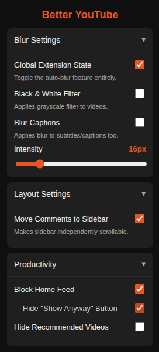

# Better YouTube
    

A comprehensive focus and layout suite for YouTube. This extension is designed to eliminate addictive UI elements, improve video viewing ergonomics, and protect focus by blurring playback when the user is not actively engaged with the tab.

---

## Features

<table>
  <tr>
    <td width="65%" valign="top">

### Blur and Privacy
* **Automated Focus Blur**: Blurs the video player immediately when the browser tab loses focus or is hidden.
* **In-Player Toggle**: Injects a native-styled button into the YouTube action bar to toggle the global blur state.
* **Adjustable Intensity**: Provides a range slider (0px to 100px) in the popup to customize the strength of the blur effect.
* **Black and White Filter**: Applies a grayscale filter to the video, removing colors.
* **Blur Captions**: Extends the blur and grayscale filters to the closed captions as well.

### Productivity and Discipline
* **Home Feed Blocking**: Removes the recommendation grid from the home page and replaces it with a focus prompt: "Do you really need to be on here?"
* **Temporary Override**: Includes an optional button to reveal the home feed for one minute before automatically re-hiding it.
* **Hardcore Mode**: A setting to disable the "Show anyway" button, preventing any bypass of the home feed block.
* **Sidebar Cleaning**: Hides the "Watch Next" recommended video sidebar to prevent rabbit-hole browsing.

### Layout Optimization
* **Sidebar Comments**: Relocates the comment section to the right-hand sidebar.
* **Independent Scrolling**: Configures the sidebar to scroll independently of the main video, allowing users to read comments without the video scrolling out of view.

    </td>
    <td width="35%" valign="middle" align="center">
      
      
<em>Recommended Settings</em>

    </td>
  </tr>
</table>

---

## Installation

1. Download the project files to a local directory.
2. Open Google Chrome and go to `chrome://extensions/`.
3. Enable **Developer mode** using the toggle in the top right.
4. Click **Load unpacked** and select the folder containing the extension.
5. It is recommended to pin the extension to the toolbar for easy access to the settings submenus.

---

## File Structure

* **manifest.json**: Configuration file set to `document_start` to ensure UI elements are hidden before they can flicker onto the screen.
* **content.js**: The core logic engine that manages DOM manipulation, focus events, and the mutation observer.
* **popup.html / popup.js**: A categorized, accordion-style interface for managing Blur, Layout, and Productivity settings.

---

## Technical Details

### Resilient Initialization
To handle YouTube's Single Page Application (SPA) architecture, the extension uses a recursive `try/catch` loop within the initialization phase. This ensures that the MutationObserver successfully attaches to the DOM root even if the script executes before the browser has fully initialized the Document Node.

### Performance and Stability
The script utilizes an `isApplying` guard variable to prevent infinite loops. Since the extension actively modifies the DOM (such as moving the comment section), this guard ensures that the observer does not re-trigger the logic based on the extension's own changes.

### Layout Engineering
The comment-swapping feature uses dynamic CSS calculations (`calc(100vh - 70px)`) to set the sidebar height relative to the viewport. By setting `overflow-y: auto`, the sidebar becomes a localized scroll container, maintaining the video's fixed position.

### Storage and Synchronization
All user preferences are stored using `chrome.storage.local`. This provides higher rate limits than the sync alternative and ensures that settings are applied instantly across all open YouTube tabs via message passing.

---

## License
MIT